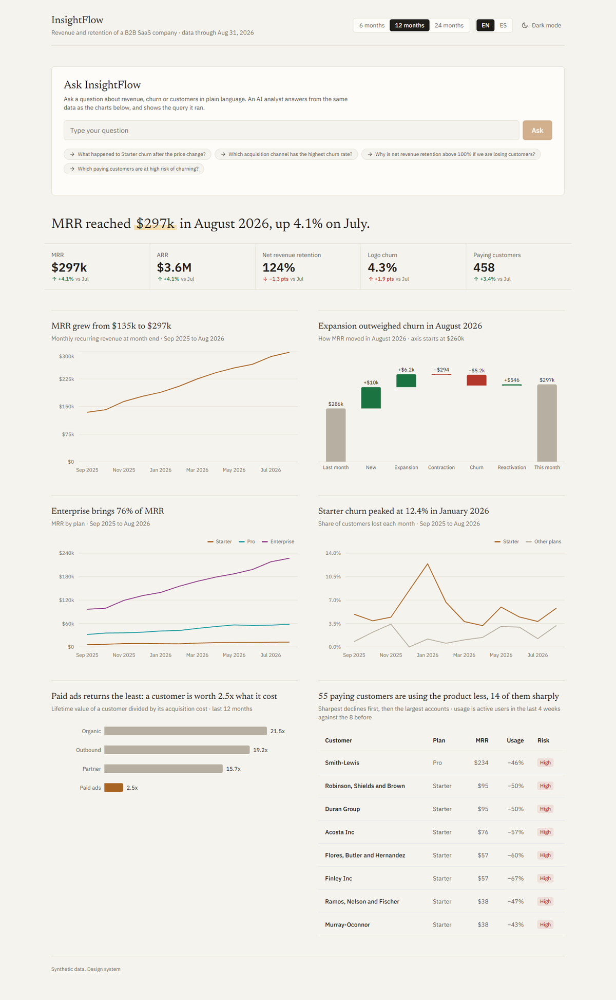
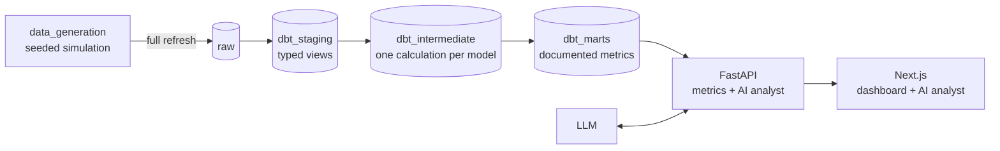
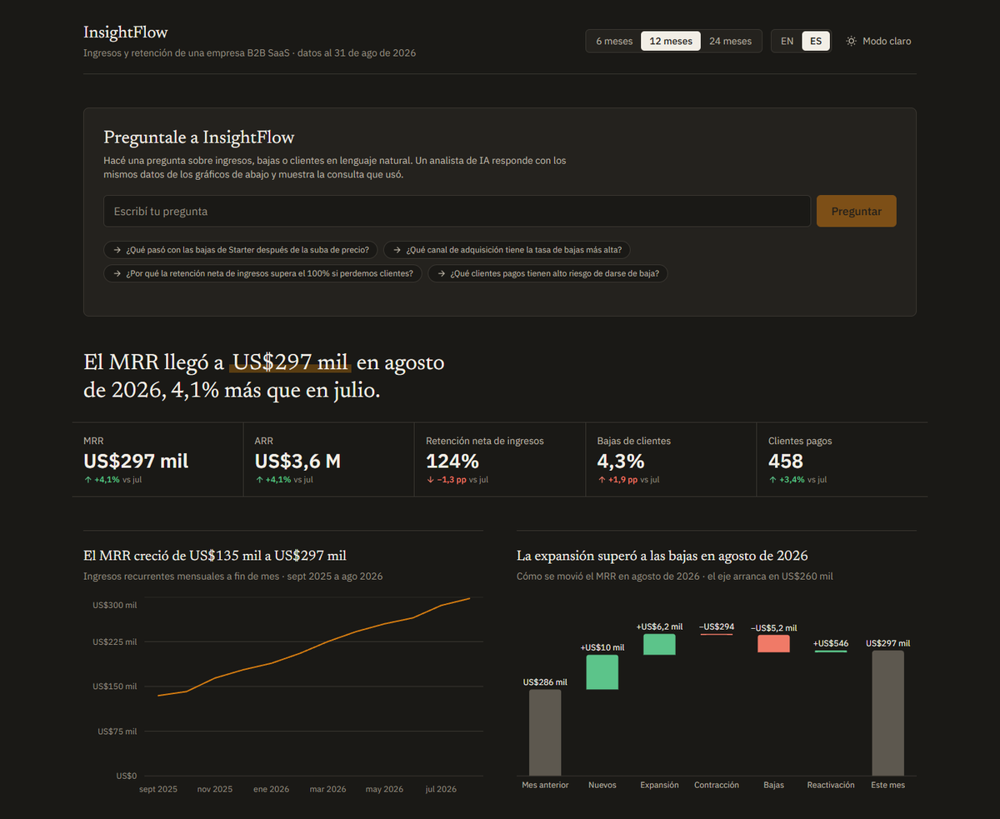
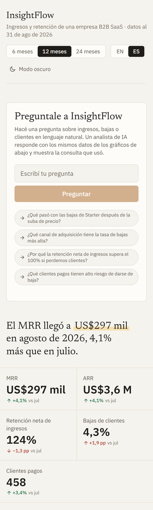
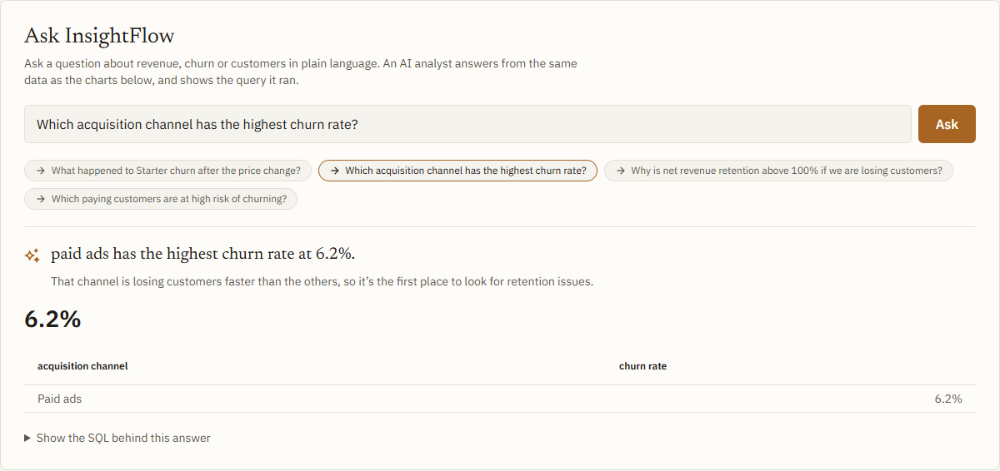

# InsightFlow

An analytics platform for a fictional B2B SaaS company: realistic synthetic
data in BigQuery, modeled with dbt into business metrics (MRR, churn,
retention, unit economics), served by an API to a one-page web dashboard with
an AI analyst that answers business questions in plain English or Spanish.

**Live:** [insight-flow-five-beta.vercel.app](https://insight-flow-five-beta.vercel.app/)
(Spanish at [/es](https://insight-flow-five-beta.vercel.app/es)) ·
[API docs](https://insightflow-api-936762673660.europe-west1.run.app/docs)



The data is not random noise. It is generated to hide five business stories
(a price increase that backfires, a channel that brings customers who leave
fast, expansion revenue that outweighs churn, usage that fades before a
cancellation, seasonality) so that the dashboard and the agent have something
real to find.

## Status

The project was rebuilt in four phases:

- [x] **Phase 1 — Data:** deterministic synthetic history and layered dbt models
- [x] **Phase 2 — API:** FastAPI service for metrics and the agent
- [x] **Phase 3 — Web:** Next.js dashboard with the AI analyst, in English and Spanish
- [x] **Phase 4 — Deploy:** API on Cloud Run, web on Vercel

The previous version, a Streamlit app in `agent/`, is still
[live](https://insightflow-agent2.streamlit.app/) on the legacy tables until
the new web app replaces it.

## Architecture



- **Generation:** a month-by-month simulation of a customer base: 14-day trials,
  conversions, plan and seat changes, a price change, churn, reactivations,
  invoices, weekly product usage and marketing spend. The same seed always
  produces the same data.
- **Storage:** Google BigQuery (EU). Data is generated once and loaded by hand;
  nothing runs on a schedule.
- **Transformation:** dbt Core with dbt-bigquery, in three layers. Every mart
  model and column is documented; those descriptions are the agent's context.
- **API:** FastAPI, the only way to reach BigQuery. Fixed, parameterized
  queries for the dashboard metrics, and an AI analyst that writes SQL,
  which is validated before it runs.
- **Web:** Next.js 16, React 19, Tailwind 4 and Recharts, on components from
  Tremor's open-source dashboard template, restyled with its own design system.

## The data

24 months, September 2024 to August 2026. By the end: 458 paying customers,
$297k MRR ($3.6M ARR) and 124% net revenue retention.

| Table | Content |
|---|---|
| `organizations` | 1,183 companies that started a trial, with industry, country, size and acquisition channel |
| `plans` | Starter, Pro and Enterprise per-seat prices, with price history |
| `subscriptions` | One row per subscription period; any plan, seat or price change opens a new one |
| `invoices` | Monthly invoices, paid, failed or refunded |
| `product_events` | Weekly activity per company: active users, logins, dashboards, queries, exports |
| `marketing_spend` | Monthly spend per acquisition channel |

### Stories hidden in the data

| # | Story | Question that reveals it |
|---|---|---|
| 1 | The Starter price increase in November 2025 more than doubles Starter churn for three months | *What happened to Starter churn after the price change?* |
| 2 | Paid ads customers churn about twice as often in their first six months; LTV:CAC of 2.5 vs 15+ elsewhere | *Which acquisition channel has the highest churn rate, and how do the unit economics compare?* |
| 3 | Enterprise seat expansion pushes NRR to 124% while a quarter of customers leave | *Why is net revenue retention above 100% if we are losing customers?* |
| 4 | Usage fades 6 to 10 weeks before a customer churns; a risk flag catches it | *Which customers are at risk of churning?* |
| 5 | Fewer signups in December and January, a peak in March | *In which months do we sign up the most new customers?* |

Each story, its figures and how it is tested: [docs/data-stories.md](docs/data-stories.md).

## dbt models

| Layer | Dataset | Models |
|---|---|---|
| Staging | `dbt_staging` | One typed view per raw table |
| Intermediate | `dbt_intermediate` | Month spine, MRR per company per month, MRR movements, weekly activity with trends, acquisition cohorts |
| Marts | `dbt_marts` | See below |

| Mart | One row per | What it answers |
|---|---|---|
| `kpi_summary` | month | Headline KPIs and their change against the previous month |
| `fct_mrr_monthly` | month × plan × channel × company size | MRR and ARR with any breakdown |
| `fct_mrr_movements` | month | MRR bridge: new, expansion, contraction, churn, reactivation |
| `fct_churn` | month × total / plan / channel | Logo and revenue churn |
| `fct_retention_cohorts` | cohort × months since first payment | Logo and revenue retention matrix |
| `fct_unit_economics` | month × channel | CAC, ARPA, LTV, LTV:CAC, payback |
| `dim_organizations` | company | Current status, MRR, usage trend and churn risk |
| `dim_plans` | plan price version | Price history, including when prices changed |

## Getting started

Requirements: Python 3.11+, a Google Cloud project with BigQuery, and the
`gcloud` CLI.

```bash
pip install -r requirements.txt
gcloud auth application-default login    # used by the generator and dbt
```

Generate the data locally (Parquet files in `data_generation/output/`, no
BigQuery needed):

```bash
python -m data_generation.build --dry-run --end-month 2026-08
```

Generate and load it into BigQuery (replaces every `raw` table):

```bash
python -m data_generation.build --end-month 2026-08
```

Without `--end-month`, the window ends in the last complete month, so dates and
figures differ from the ones documented here. Use `--seed` for another dataset
that tells the same stories with different numbers.

Build and test the dbt models:

```bash
cd dbt_insightflow
dbt build --profiles-dir .
```

The project ID and region are set in `data_generation/config.py` and
`dbt_insightflow/profiles.yml`.

## API

```bash
cp .env.example .env        # add OPENAI_API_KEY and LLM_MODEL for /ask
uvicorn api.main:app --reload
```

Interactive docs at http://localhost:8000/docs. Money is USD and rates are
fractions (0.05 = 5%); formatting is left to the client.

| Endpoint | Returns |
|---|---|
| `GET /health` | Liveness (no query) |
| `GET /metrics/summary` | Headline KPIs of a month with their change against the previous month |
| `GET /metrics/mrr` | MRR series, total or by plan, channel or company size |
| `GET /metrics/mrr-movements` | Monthly MRR bridge |
| `GET /metrics/churn` | Logo and revenue churn, total or by plan or channel |
| `GET /metrics/retention` | Cohort retention matrix |
| `GET /metrics/unit-economics` | CAC, LTV, LTV:CAC and payback per channel |
| `GET /customers/at-risk` | Paying customers with fading usage, largest MRR first |
| `POST /ask` | The AI analyst: answer, insight, SQL, rows and a chart suggestion |

Metric filters (`start_month`, `end_month` as `YYYY-MM`, `plan`, `channel`,
`breakdown`) are validated and bound as query parameters. Results are cached in
memory, since the data is static.

### How `/ask` works

1. The model receives the marts context, generated from the dbt documentation
   by `python -m api.agent.context` (types and coverage come from BigQuery),
   and writes one BigQuery query, or declines if the data cannot answer.
2. The query is validated with sqlglot: a single read-only SELECT over the
   eight marts only (no other datasets, legacy tables, `INFORMATION_SCHEMA`
   or table functions), with its LIMIT capped at 500.
3. It runs with a cap on bytes billed. A rejected query, a BigQuery error or an
   empty result goes back to the model once.
4. A second call reads the real rows and writes the answer, an insight and a
   chart suggestion, in the page's language (`language`: `en` or `es`) with
   its number formats. Every number in the answer is checked against the rows,
   and every word must be in the Latin script; an answer that fails is
   rewritten once, then replaced by a neutral answer next to the data.

`/ask` allows 5 questions per minute per client and 200 per day in total, and
logs every question, SQL attempt, validation result and duration to
`logs/ask.jsonl` (to stdout, and so Cloud Logging, in production). The LLM
provider is confined to `api/llm.py`.

## Web

One page, top to bottom:

1. **Ask InsightFlow**, the AI analyst, first: a question in plain language (or
   one of four suggested questions that lead to the data stories) returns the
   answer, a chart drawn with the dashboard's own components, the result table
   and the SQL it ran.
2. The month's finding as a sentence and the headline KPIs (MRR, ARR, NRR,
   logo churn, paying customers) with their change against the previous month.
3. Six sections, each titled with what it shows: MRR trend, last month's MRR
   bridge (waterfall), MRR by plan, Starter churn against the other plans,
   return per acquisition channel (LTV to CAC), and customers whose usage is
   fading.

A 6 / 12 / 24-month period filter, light and dark themes, and English (`/`) or
Spanish with Argentine formats (`/es`), all in the URL so a link opens the same
view. Every number comes from the API; chart titles are findings built from it.

| Dark mode, Spanish | Phone |
|---|---|
|  |  |



**Design system** ("an analyst's report"): warm neutrals, one ochre accent, gain
and loss colors reserved for improves and worsens, data colors validated for
colorblind separation, Newsreader for findings and IBM Plex Sans for the
interface and numbers. Tokens live as CSS variables in `web/src/app/globals.css`;
`/styleguide` documents them.

```bash
cd web
cp .env.example .env.local   # API_URL and NEXT_PUBLIC_API_URL point to the API
npm install
npm run dev                  # http://localhost:3000
```

The API must allow the web origin (`ALLOWED_ORIGINS`, default
`http://localhost:3000`) for the AI analyst, which the browser calls directly.

## Tests

- **Python** (`pytest`): the generator is deterministic, keys and relationships
  hold, subscription periods form a valid chain, prices and invoices match,
  and each of the five stories shows up in the data.
- **dbt** (`dbt build`): keys, accepted values and relationships, plus business
  rules: the MRR bridge closes every month, all marts agree on MRR and
  customer counts, subscription periods never overlap, and rates stay in range.
- **API** (`pytest`): every endpoint against a fake BigQuery client, filter
  validation, the SQL validator's rejected and accepted queries, the `/ask`
  flow with a scripted LLM (retries, number check, charts, rate limits, log),
  and that the agent context matches the dbt documentation.
- **Live** (`pytest -m live`, on demand): one question per story against
  BigQuery and the LLM. Needs `.env` and Google credentials.
- **Web** (`npm test` in `web/`): number and date formatting in both
  languages, the period filter, the dashboard's data transformations and
  findings, and that the styleguide shows the real token values.
- **CI** (GitHub Actions): pytest and `dbt parse`, and for the web lint, type
  check, tests and a production build, on every push, without connecting to
  BigQuery or the LLM.

## Deployment

- **API on Cloud Run** (`europe-west1`, next to the EU data), built from the
  root `Dockerfile`, which holds only `api/`. It scales from 0 to at most 1
  instance and runs as its own service account, which can run BigQuery jobs
  and read `dbt_marts` and nothing else. The OpenAI key lives in Secret
  Manager.

  ```bash
  gcloud run deploy insightflow-api --source . --region europe-west1     --project insightflow-analytics-489617
  ```

  A redeploy keeps the service settings. They were set on the first deploy:
  `--service-account insightflow-api@insightflow-analytics-489617.iam.gserviceaccount.com
  --max-instances 1 --min-instances 0 --allow-unauthenticated
  --set-secrets OPENAI_API_KEY=openai-api-key:latest`, plus the env vars
  `LLM_MODEL` and `ALLOWED_ORIGINS` (the Vercel domain and localhost).
  `.gcloudignore` keeps the upload to what the image needs.
- **Web on Vercel**, from the GitHub repo with root directory `web`. Every
  push to `main` deploys. `API_URL` and `NEXT_PUBLIC_API_URL` point to the
  Cloud Run URL; the second is built into the browser code, so changing it
  needs a redeploy.

## Cost

The whole dataset is a few MB. A full `dbt build` processes about 10 MB; since
BigQuery bills at least 10 MB per table read, it is billed as roughly 1 GB,
under one cent at on-demand prices and inside the monthly free tier. dbt
queries are capped with `maximum_bytes_billed`.

In production, Cloud Run scales to zero and stays inside its free tier at demo
traffic; metrics are cached in memory, and `/ask` is capped per minute, per
day and in bytes billed. A US$5 budget alert watches the project.

## Project structure

```text
data_generation/   seeded simulation and BigQuery loader (python -m data_generation.build)
dbt_insightflow/   dbt project: staging → intermediate → marts, tests
api/               FastAPI: metrics endpoints and the AI analyst (api/agent/)
web/               Next.js: the dashboard, design system and /styleguide
docs/              data stories, screenshots
tests/             pytest: generator, data stories and API
agent/             legacy Streamlit app (to be replaced)
```

## Author

**Antuel Quirino**, Analytics Engineer

[](https://www.linkedin.com/in/antuel-quirino)
[](https://github.com/antuelquirino)
