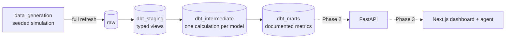

# InsightFlow

An analytics platform for a fictional B2B SaaS company: realistic synthetic
data in BigQuery, modeled with dbt into business metrics (MRR, churn,
retention, unit economics), to be served by an API to a web dashboard and an
AI agent that answers business questions in plain English.

The data is not random noise. It is generated to hide five business stories
(a price increase that backfires, a channel that brings customers who leave
fast, expansion revenue that outweighs churn, usage that fades before a
cancellation, seasonality) so that the dashboard and the agent have something
real to find.

## Status

The project is being rebuilt in four phases:

- [x] **Phase 1 — Data:** deterministic synthetic history and layered dbt models
- [ ] **Phase 2 — API:** FastAPI service for metrics and the agent
- [ ] **Phase 3 — Web:** Next.js dashboard and chat
- [ ] **Phase 4 — Deploy:** API on Cloud Run, web on Vercel

The previous version, a Streamlit app in `agent/`, is still
[live](https://insightflow-agent2.streamlit.app/) on the legacy tables until
the new web app replaces it.

## Architecture



- **Generation:** a month-by-month simulation of a customer base: 14-day trials,
  conversions, plan and seat changes, a price change, churn, reactivations,
  invoices, weekly product usage and marketing spend. The same seed always
  produces the same data.
- **Storage:** Google BigQuery (EU). Data is generated once and loaded by hand;
  nothing runs on a schedule.
- **Transformation:** dbt Core with dbt-bigquery, in three layers. Every mart
  model and column is documented; those descriptions will be the agent's
  context.

## The data

24 months, September 2024 to August 2026. By the end: 458 paying customers,
$297k MRR ($3.6M ARR) and 124% net revenue retention.

| Table | Content |
|---|---|
| `organizations` | 1,183 companies that started a trial, with industry, country, size and acquisition channel |
| `plans` | Starter, Pro and Enterprise per-seat prices, with price history |
| `subscriptions` | One row per subscription period; any plan, seat or price change opens a new one |
| `invoices` | Monthly invoices, paid, failed or refunded |
| `product_events` | Weekly activity per company: active users, logins, dashboards, queries, exports |
| `marketing_spend` | Monthly spend per acquisition channel |

### Stories hidden in the data

| # | Story | Question that reveals it |
|---|---|---|
| 1 | The Starter price increase in November 2025 more than doubles Starter churn for three months | *What happened to Starter churn after the price change?* |
| 2 | Paid ads customers churn about twice as often in their first six months; LTV:CAC of 2.5 vs 15+ elsewhere | *Which acquisition channel has the highest churn rate, and how do the unit economics compare?* |
| 3 | Enterprise seat expansion pushes NRR to 124% while a quarter of customers leave | *Why is net revenue retention above 100% if we are losing customers?* |
| 4 | Usage fades 6 to 10 weeks before a customer churns; a risk flag catches it | *Which customers are at risk of churning?* |
| 5 | Fewer signups in December and January, a peak in March | *In which months do we sign up the most new customers?* |

Each story, its figures and how it is tested: [docs/data-stories.md](docs/data-stories.md).

## dbt models

| Layer | Dataset | Models |
|---|---|---|
| Staging | `dbt_staging` | One typed view per raw table |
| Intermediate | `dbt_intermediate` | Month spine, MRR per company per month, MRR movements, weekly activity with trends, acquisition cohorts |
| Marts | `dbt_marts` | See below |

| Mart | One row per | What it answers |
|---|---|---|
| `kpi_summary` | month | Headline KPIs and their change against the previous month |
| `fct_mrr_monthly` | month × plan × channel × company size | MRR and ARR with any breakdown |
| `fct_mrr_movements` | month | MRR bridge: new, expansion, contraction, churn, reactivation |
| `fct_churn` | month × total / plan / channel | Logo and revenue churn |
| `fct_retention_cohorts` | cohort × months since first payment | Logo and revenue retention matrix |
| `fct_unit_economics` | month × channel | CAC, ARPA, LTV, LTV:CAC, payback |
| `dim_organizations` | company | Current status, MRR, usage trend and churn risk |

## Getting started

Requirements: Python 3.11+, a Google Cloud project with BigQuery, and the
`gcloud` CLI.

```bash
pip install -r requirements.txt
gcloud auth application-default login    # used by the generator and dbt
```

Generate the data locally (Parquet files in `data_generation/output/`, no
BigQuery needed):

```bash
python -m data_generation.build --dry-run --end-month 2026-08
```

Generate and load it into BigQuery (replaces every `raw` table):

```bash
python -m data_generation.build --end-month 2026-08
```

Without `--end-month`, the window ends in the last complete month, so dates and
figures differ from the ones documented here. Use `--seed` for another dataset
that tells the same stories with different numbers.

Build and test the dbt models:

```bash
cd dbt_insightflow
dbt build --profiles-dir .
```

The project ID and region are set in `data_generation/config.py` and
`dbt_insightflow/profiles.yml`.

## Tests

- **Python** (`pytest`): the generator is deterministic, keys and relationships
  hold, subscription periods form a valid chain, prices and invoices match,
  and each of the five stories shows up in the data.
- **dbt** (`dbt build`): keys, accepted values and relationships, plus business
  rules: the MRR bridge closes every month, all marts agree on MRR and
  customer counts, subscription periods never overlap, and rates stay in range.
- **CI** (GitHub Actions): pytest and `dbt parse` on every push, without
  connecting to BigQuery.

## Cost

The whole dataset is a few MB. A full `dbt build` processes about 10 MB; since
BigQuery bills at least 10 MB per table read, it is billed as roughly 1 GB,
under one cent at on-demand prices and inside the monthly free tier. dbt
queries are capped with `maximum_bytes_billed`.

## Project structure

```text
data_generation/   seeded simulation and BigQuery loader (python -m data_generation.build)
dbt_insightflow/   dbt project: staging → intermediate → marts, tests
docs/              data stories
tests/             pytest: generator invariants and data stories
agent/             legacy Streamlit app (to be replaced)
```

## Author

**Antuel Quirino**, Analytics Engineer

[](https://www.linkedin.com/in/antuel-quirino)
[](https://github.com/antuelquirino)
